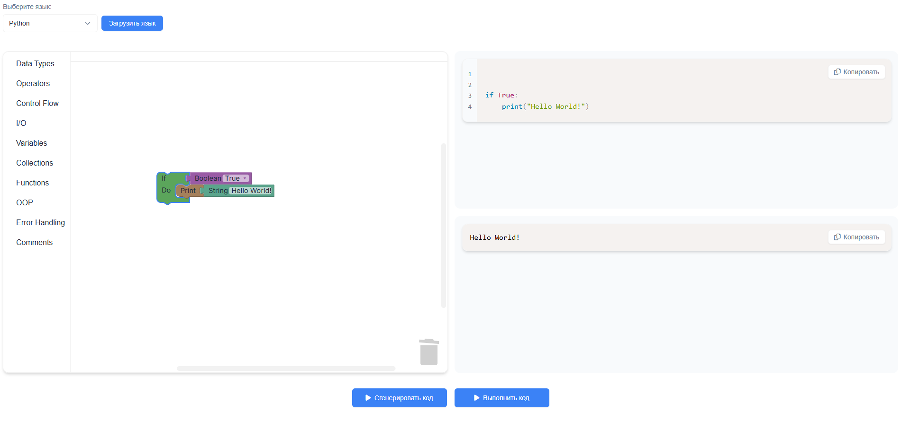

<p align="center">
  
</p>

# SimpleBlocks 
📘 This README is available in: [English](docs/EN/README.md)

**Визуальная среда для обучения программированию с поддержкой множества языков**.  

---
Поддерживаемые языки:
- C#
- C++
- Dart
- Go
- Java
- JavaScript
- Lua
- PHP
- Python
- Rust
- Ruby
- TypeScript
- Kotlin
- Swift

  _(Можно добавить любой язык через конфиги)_

---

## 🚀 Возможности
- 🧱 Визуальное создание кода из блоков (аналог Scratch/Blockly)
- ▶️ Запуск кода через Judge0 (C#, Python и др.)
- 🧩 Гибкая архитектура (.NET 9 + Blazor Standalone)
- 🔧 Простое добавление языков через `blocks.json` и `semantics.json`

## 🛠 Технологии
- **Backend**: ASP.NET Core (.NET 9)
- **Frontend**: Blazor Standalone
- **СУБД**: PostgreSQL
- **Выполнение кода**: Judge0

---

## 🏁 Быстрый старт
### Вариант 1: Локальный запуск
#### 1. **Склонируйте репозиторий**:

   ```bash  
   git clone https://github.com/SimpleBlocks.git
   cd SimpleBlocks
   ```
#### 2. **Запустите Postgres и внедрите переменные окружения (либо измените appsettings.json)**.

#### 3. **Настройте ops/judge0.conf и запустите Judge0 (через Docker)**:

  ```bash
  cd ops  
  docker-compose -f docker-compose.judge0.yml up -d  
  ```

#### 4. **Установка .NET 9**.

   [Скачать SDK](https://dotnet.microsoft.com/ru-ru/download)

#### 5. **Запустите сервер**:

  ```bash
  cd src/SimpleBlocks.Server
  dotnet restore # Восстановление зависимостей
  dotnet ef database update # Применение миграций
  dotnet run
  ```

#### 6. **Запустите клиент**:

  ```bash
  cd ../SimpleBlocks.Client
  dotnet restore
  dotnet run 
  ```
   
### Вариант 2: Запуск в Docker
#### 1. **Настройте переменные конфигурации .env и judge0.conf в ops**
#### 2. **Запустите проект при помощи `docker-compose`**

  ```bash
  cd ops  

  docker-compose -f docker-compose.postgres.yml -f docker-compose.judge0.yml -f docker-compose.server.yml -f docker-compose.client.yml up -d
  ```

---

## 📝 [Добавление языка](docs/RU/LANGUAGE_GUIDE.md)

---

## 🏗 Архитектура

- Общий вид:
  ```mermaid
  flowchart LR
      A[Client: генерация кода из блоков] -->|Отправка кода| B[Server]
      B -->|Выполнение| C[Judge0]
      B -->|Чтение/запись| D[PostgreSQL]
      C -->|Хранение| D
      C -->|Кэш| E[Redis]
  ```
- [Подробнее](docs/RU/ARCHITECTURE.md)

---

## 🖼 Интерфейс

<p align="center">
  
</p>

---

## 📜 Лицензия
MIT – см. [LICENSE](LICENSE).

## 🔗 Ссылки:
1. [Judge0 Documentation](https://ce.judge0.com/)
2. [Blockly Documentation](https://developers.google.com/blockly)
