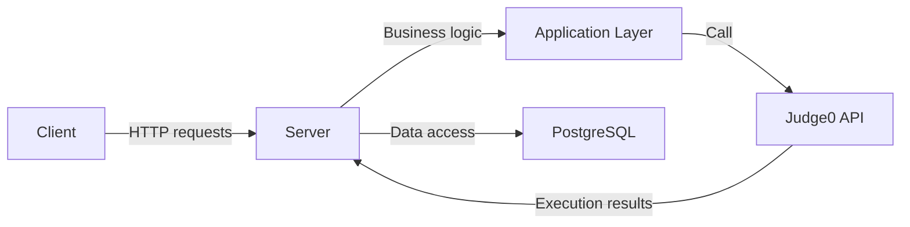


SimpleBlocks Architecture

The `SimpleBlocks` project is built following the principles of **Clean Architecture** with elements of the **Vertical Slice** approach. It is divided into three main projects:

1. `SimpleBlocks.Client` – Client side (Blazor Standalone)  
   A SPA written in Blazor. Responsible for the visual block editor, code generation, and API interaction.

Key directories:
- `Components/`, `Pages/`, `Layout/` – UI components and pages.
- `Services/` – feature classes.
- `Helpers/`, `Extensions/` – utility classes.
- `Configuration/` – client configuration.
- `wwwroot/` – static assets (CSS, JS, etc.) and client appsettings.json.

Code generation from blocks happens here: the visual editor converts blocks to XML/JSON, then into code.

2. `SimpleBlocks.Server` – Server side (ASP.NET Core)  
   A Web API responsible for storing and executing code, managing configurations, and interacting with Judge0.

Architectural layers:
- `Api/` – controllers and routes.
- `Application/` – business logic, use cases.
- `Domain/` – entities and contracts (domain invariants).
- `Infrastructure/` – integrations with external systems (Judge0, Redis, email, etc.).
- `Persistence/` – data access, repository implementations.

The server processes the generated code, sends it to Judge0, and stores language files in PostgreSQL.

3. `SimpleBlocks.Shared` – Shared models  
   Contains common DTOs, enums, and models used by both client and server.

Contents:
- `Dto/` – API data models.
- `Enums/` – enumerations describing language types, execution statuses, etc.
- `Models/` – business models independent of layers.

This avoids code duplication between `Client` and `Server`.

📡 Component interaction:

🛠 Approaches used:
- Clean Architecture: strict layer boundaries, dependency inversion.
- Vertical Slice Architecture: features grouped by use cases rather than technical layers.
- Infrastructure isolation: all external dependencies (Judge0, DB) are encapsulated.
