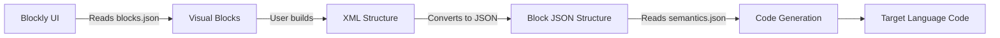

# 📚 File Formats: Semantics and Blocks

This document describes the file formats used to define blocks and their semantics in the system. Also check out the [prompt for the generative model](../LANGUAGE_PROMPT.md).

1. **`blocks.json`** – describes blocks for the Blockly visual editor and the Toolbox structure.
2. **`semantics.json`** – describes the transpilation rules for converting blocks to the target programming language.



## 📄 Semantics File (`semantics.json`)

This file defines how each block should be interpreted in a specific programming language (e.g., C#).
Each block is represented as an object with two main fields: `schema` and `languageImports`.

- **`schema`** – a string template for code generation using placeholders in curly braces `{}` to insert values from the block fields.
- **`languageImports`** (optional) – an array of strings with the necessary imports for the language structure.

### 🔧 General Structure:
```json
{
  "NameConfiguration": {
    "name": "C#",
    "prism": "csharp",
    "judge0": 51
  },
  "SyntaxConfiguration": {
    "indent": "    ",
    "block_start": "{",
    "block_end": "}",
    "statement_separator": ";",
    "assigment_symbol": "="
  },
  "Print": {
    "schema": "Console.WriteLine({inputFields.content}){statement_separator}",
    "languageImports": [
      "using System;"
    ]
  },
  "IfStatement": {
    "schema": "if ({inputFields.condition}) {block_start}{body}{block_end}"
  }
}
```

### Name Configuration:
- `name` — language name.
- `prism` — Prism.js syntax highlighter ID.
- `judge0` — Judge0 system language ID.

### 🧩 Placeholders:
- `{inputFields.<name>}` — value from Blockly field.
- `{body}` — nested blocks.
- `{indent}` — indentation.
- `{statement_separator}` — semicolon (e.g., `;`).
- `{block_start}` / `{block_end}` — block opening/closing (usually `{` and `}`).

---

## 🧱 Blocks File (`blocks.json`)

This file describes the visual blocks for Blockly: their types, fields, interaction, and colors. It also contains the XML structure for the toolbox.
The file has two main sections:
1. **`blocks`** – an array of objects describing individual blocks.
2. **`toolbox`** – an XML structure defining the categories and placement of blocks in the toolbox.

### 🔧 General Structure:
```json
{
  "blocks": [
    {
      "type": "Print",
      "message0": "Print %1",
      "args0": [
        {
          "type": "input_value",
          "name": "content"
        }
      ],
      "colour": 160,
      "previousStatement": null,
      "nextStatement": null
    }
  ],
  "toolbox": [
    "<xml>",
    "  <category name='Text'>",
    "    <block type='Print'></block>",
    "    <block type='Text'></block>",
    "  </category>",
    "  <category name='Logic'>",
    "    <block type='IfStatement'></block>",
    "    <block type='LogicCompare'></block>",
    "    <block type='Boolean'></block>",
    "  </category>",
    "</xml>"
  ]
}
```

### 🛠️ Block Fields:
| Field               | Type      | Description |
|---------------------|-----------|-------------|
| `type`              | `string`  | Unique block name |
| `message0`          | `string`  | Display text with `%1`, `%2`, ... placeholders |
| `args0`             | `array`   | Block parameters |
| `colour`            | `number`  | Block color |
| `previousStatement` | `null` / `string` | Connection to previous block |
| `nextStatement`     | `null` / `string` | Connection to next block |
| `output`            | `string`  | Output type (for expressions) |

### 📥 Argument Types in `args0`:
- `input_value` — input value (connects to other blocks).
- `field_input` — text field.
- `field_number` — numeric field.
- `field_checkbox` — boolean checkbox.
- `input_statement` — nested blocks (e.g., loop body).

### 🧩 Block Argument Types:
| Type              | Example Use                  | Description                |
|-------------------|------------------------------|----------------------------|
| `input_value`     | Connecting other blocks       | For expressions (`x > 5`)  |
| `input_statement` | Loop/condition body           | For nested structures      |
| `field_dropdown`  | Operator selection (`+`, `-`) | Fixed options              |

---

## 🧰 Toolbox Example (XML):
```xml
<xml>
  <category name='Text'>
    <block type='Print'></block>
    <block type='Text'></block>
  </category>
  <category name='Logic'>
    <block type='IfStatement'></block>
    <block type='LogicCompare'></block>
    <block type='Boolean'></block>
  </category>
</xml>
```

## Workflow

1. **Create Blocks**:
    - Define all required blocks for the target language.
    - Describe them in the `blocks.json` file, including appearance, arguments, and connections.

2. **Define Semantics**:
    - For each block, create a corresponding entry in the `semantics.json` file.
    - Make sure templates (`schema`) correctly describe code generation.

3. **Configure Toolbox**:
    - Organize blocks by categories in the `toolbox` section of `blocks.json`.

4. **Test**:
    - Verify all blocks work correctly in the visual editor.
    - Ensure the transpilation to the target language functions as expected.
