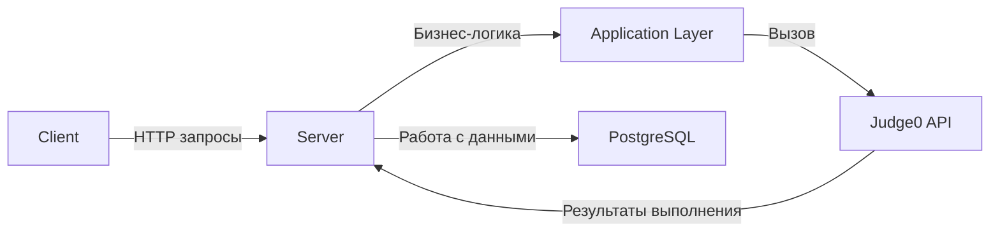


🏗 Архитектура проекта

Проект `SimpleBlocks` построен по принципам **чистой архитектуры** с элементами **Vertical Slice** подхода. Он разделён на три основных проекта:

1. `SimpleBlocks.Client` – Клиентская часть (Blazor Standalone)
   Представляет собой SPA, написанную на Blazor. Отвечает за визуальный редактор блоков, генерацию кода и взаимодействие с API.

Ключевые директории:
- `Components/`, `Pages/`, `Layout/` – UI-компоненты и страницы.
- `Services/` – классы для различных фичей.
- `Helpers/`, `Extensions/` – вспомогательные классы.
- `Configuration/` – конфигурация клиента.
- `wwwroot/` – статические ресурсы (CSS, JS, и т.д.) а также appsetting.json для конфигурации клиента.

Генерация кода из блоков происходит здесь: визуальный редактор преобразует блоки в XML/JSON, затем в код.

2. `SimpleBlocks.Server` – Серверная часть (ASP.NET Core)
   Представляет собой Web API, отвечающее за хранение и выполнение кода, управление конфигурациями и взаимодействие с Judge0.

Архитектурные слои:
- `Api/` – контроллеры и маршруты.
- `Application/` – бизнес-логика, use cases.
- `Domain/` – сущности и контракты (инварианты предметной области).
- `Infrastructure/` – интеграции с внешними системами (Judge0, Redis, e-mail и т.д.).
- `Persistence/` – доступ к данным, реализация репозиториев.

Сервер обрабатывает сгенерированный код, передаёт его в Judge0, а также хранит файлы языков в базе данных PostgreSQL.

3. `SimpleBlocks.Shared` – Общие модели
   Проект, содержащий общие DTO, enum'ы и модели, используемые клиентом и сервером.

Содержимое:
- `Dto/` – модели данных для API.
- `Enums/` – перечисления, описывающие типы языков, статусы выполнения и т.п.
- `Models/` – бизнес-модели, не зависящие от слоёв.

Это позволяет избежать дублирования кода между `Client` и `Server`.

📡 Взаимодействие компонентов:

🛠 Используемые подходы:
- Чистая архитектура: строгие границы между слоями, инверсии зависимостей.
- Vertical Slice Architecture: фичи сгруппированы по случаям использования, а не по техническим слоям.
- Инфраструктурная изоляция: всё внешнее (Judge0, БД) инкапсулировано.
