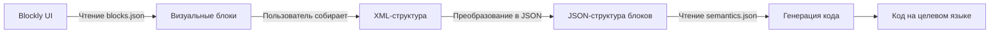

# 📚 Форматы файлов: Семантика и Блоки

Данный документ описывает форматы файлов, используемых для описания блоков и их семантики в системе. Также посмотрите на [промпт для генеративной модели](../LANGUAGE_PROMPT.md).

1. **`blocks.json`** – файл, описывающий блоки для визуального редактора Blockly и структуру Toolbox.
2. **`semantics.json`** – файл, описывающий правила транспиляции блоков в целевой язык программирования.




## 📄 Файл семантики (`semantics.json`)

Файл описывает, как каждый блок должен быть интерпретирован в конкретный язык программирования (например, C#).
Каждый блок описывается в виде объекта с двумя основными полями: `schema` и `languageImports`.

- **`schema`** – строка, описывающая шаблон генерации кода для блока. Использует плейсхолдеры в фигурных скобках `{}` для вставки значений из полей блока.
- **`languageImports`** (опционально) – массив строк с необходимыми импортами для данной структуры языка.

### 🔧 Общая структура:
```json
{
  "NameConfiguration": {
    "name": "C#",
    "prism": "csharp",
    "judge0": 51
  },
  "SyntaxConfiguration": {
    "indent": "    ",
    "block_start": "{",
    "block_end": "}",
    "statement_separator": ";",
    "assigment_symbol": "="
  },
  "Print": {
    "schema": "Console.WriteLine({inputFields.content}){statement_separator}",
    "languageImports": [
      "using System;"
    ]
  },
  "IfStatement": {
    "schema": "if ({inputFields.condition}) {block_start}\n{body}\n{block_end}"
  }
}
```

### Конфигурация названий:
- `name` — название языка.
- `prism` — идентификатор для подсветки синтаксиса в Prism.js.
- `judge0` — ID языка для системы Judge0.

### 🧩 Плейсхолдеры:
- `{inputFields.<name>}` — значение из поля Blockly.
- `{body}` — вложенные блоки.
- `{indent}` — отступ.
- `{statement_separator}` — точка с запятой (например, `;`).
- `{block_start}` / `{block_end}` — открытие/закрытие блока (обычно `{` и `}`).

---

## 🧱 Файл блоков (`blocks.json`)

Файл описывает визуальные блоки для Blockly: их типы, поля, взаимодействие с другими блоками и цвета. Также содержит XML-структуру toolbox'а.
Файл состоит из двух основных секций:
1. **`blocks`** – массив объектов, описывающих сами блоки.
2. **`toolbox`** – XML-структура, определяющая категорию и расположение блоков в Toolbox.
### 🔧 Общая структура:
```json
{
  "blocks": [
    {
      "type": "Print",
      "message0": "Print %1",
      "args0": [
        {
          "type": "input_value",
          "name": "content"
        }
      ],
      "colour": 160,
      "previousStatement": null,
      "nextStatement": null
    }
  ],
  "toolbox": [
    "<xml>",
    "  <category name='Text'>",
    "    <block type='Print'></block>",
    "    <block type='Text'></block>",
    "  </category>",
    "  <category name='Logic'>",
    "    <block type='IfStatement'></block>",
    "    <block type='LogicCompare'></block>",
    "    <block type='Boolean'></block>",
    "  </category>",
    "</xml>"
  ]
}
```

### 🛠️ Поля блока:
| Поле               | Тип      | Описание |
|--------------------|----------|----------|
| `type`             | `string` | Уникальное имя блока |
| `message0`         | `string` | Отображаемый текст с плейсхолдерами `%1`, `%2`, ... |
| `args0`            | `array`  | Параметры блока |
| `colour`           | `number` | Цвет блока |
| `previousStatement`| `null` / `string` | Есть ли подключение к предыдущему блоку |
| `nextStatement`    | `null` / `string` | Есть ли подключение к следующему |
| `output`           | `string` | Тип возвращаемого значения (для выражений) |

### 📥 Типы аргументов в `args0`:
- `input_value` — входное значение (соединяется с другими блоками).
- `field_input` — текстовое поле.
- `field_number` — числовое поле.
- `field_checkbox` — чекбокс (булево).
- `input_statement` — вложенные блоки (например, тело цикла).

### 🧩 Типы аргументов блоков
| Тип              | Пример использования          | Описание                     |
|------------------|-------------------------------|------------------------------|
| `input_value`    | Подключение других блоков     | Для выражений (`x > 5`)      |
| `input_statement`| Тело цикла/условия            | Для вложенных конструкций    |
| `field_dropdown` | Выбор оператора (`+`, `-`)    | Фиксированные варианты       |

---

## 🧰 Пример Toolbox (XML):
```xml
<xml>
  <category name='Text'>
    <block type='Print'></block>
    <block type='Text'></block>
  </category>
  <category name='Logic'>
    <block type='IfStatement'></block>
    <block type='LogicCompare'></block>
    <block type='Boolean'></block>
  </category>
</xml>
```

## Процесс работы

1. **Создание блоков**:
    - Определите все необходимые блоки для целевого языка.
    - Опишите их в файле `blocks.json`, учитывая их внешний вид, аргументы и взаимодействие с другими блоками.

2. **Определение семантики**:
    - Для каждого блока создайте соответствующую запись в файле `semantics.json`.
    - Убедитесь, что шаблоны (`schema`) корректно описывают генерацию кода.

3. **Настройка Toolbox**:
    - Распределите блоки по категориям в секции `toolbox` файла `blocks.json`.

4. **Тестирование**:
    - Проверьте работу всех блоков в визуальном редакторе.
    - Убедитесь, что транспиляция в целевой язык выполняется корректно.